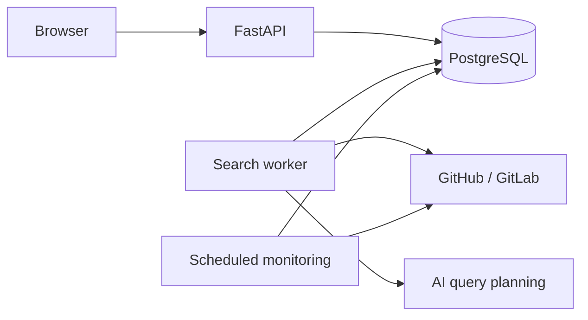

# SciScope

  

Discover scientific software for your research topic and follow repository updates in one feed.

**[Try SciScope](https://sciscope.uk/)** · [Architecture](docs/architecture.md) · [Development](backend/README.md)

## See it in action

https://github.com/user-attachments/assets/29c90665-9847-4a54-a493-ed8516fa1a54

## From a research topic to software you can follow

Scientific software is spread across repositories, and finding relevant tools often requires several searches with different terminology.

SciScope searches GitHub and GitLab from a description of your research topic. You can review the results, subscribe to useful repositories, and follow their releases and code updates in a personal feed.

1. **Describe your topic.** Enter a research area or task, such as `paramagnetic NMR tools`.
2. **Explore repositories.** SciScope generates search queries, combines results, and ranks candidates by relevance.
3. **Follow useful tools.** Subscribe to the repositories you want to monitor.
4. **Review updates.** Browse release cards and grouped commits, expand their details, and mark updates as read.

Explore is available without an account. Google sign-in enables subscriptions and your personal feed.

## Repository updates

Each new release appears as a feed card with its description and an expandable list of confirmed commits.

Other newly discovered commits are grouped by monitoring scan. Commit entries link directly to the provider, so you can inspect the original changes.

Opening a card does not mark it as read. Read actions are explicit, and incomplete release commit coverage is shown in the interface.

## How it works

SciScope is a structured monolith built with React, TypeScript, FastAPI, and PostgreSQL.

AI assists with query planning. Repository relevance is scored using an explainable heuristic based on query coverage, match location, and evidence density.

The API, search worker, and scheduled monitoring run as separate processes sharing PostgreSQL.

## Reliability and verification

- Searches run asynchronously and retain completed results when a provider is slow or unavailable.
- Provider requests have bounded deadlines and response sizes.
- Feed publications and monitoring checkpoints commit atomically.
- CI checks import boundaries, lint, scoped strict typing, backend tests, and the frontend build.
- PostgreSQL tests cover database-specific transactions and concurrency.
- Browser tests exercise search, subscriptions, grouped feed updates, and read-state behavior.

## Current scope and ongoing work

SciScope uses a heuristic ranking engine whose scoring formula is still being tuned. It can currently miss useful repositories. A training and evaluation dataset is being collected, and improving ranking quality is an active priority.

Repository discovery and monitoring currently cover GitHub and GitLab. Gitee and other hosting platforms are not yet integrated.

Multilingual support is not yet available.

## Development and documentation

- [Backend setup and package structure](backend/README.md)
- [Frontend setup](frontend/README.md)
- [Architecture and transaction guarantees](docs/architecture.md)
- [Recovery instructions](docs/operations/backend-recovery.md)
- [Browser test setup](frontend/e2e/README.md)
- [Engineering contract](AGENTS.md)

## Author

Designed and built end-to-end by **Ernest Borysenko**.
