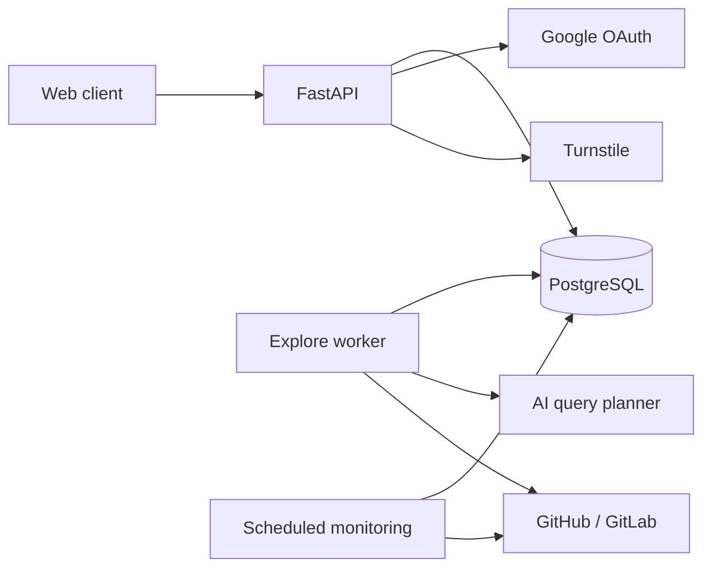

# SciScope Backend

The backend provides repository discovery, Google authentication, subscriptions,
and a personal Feed of repository activity. It is a Python application backed by
PostgreSQL, with separate API, search-worker, and scheduled monitoring processes.

## Runtime



| Process | Entrypoint | Responsibility |
| --- | --- | --- |
| HTTP API | `app.api.app:app` | Requests, sessions, search scheduling, subscriptions, and Feed reads |
| Explore worker | `app.jobs.process_search_runs` | Claims and executes durable search operations |
| Repository monitoring | `app.jobs.scan_subscriptions` | Scans watched repositories and persists new Feed events |

The container runs these processes through [Supervisor](infra/supervisord.conf).
Monitoring is scheduled every two hours by [Supercronic](infra/monitoring.crontab).
The direct search endpoint also executes the search pipeline in the API process.

Authentication and access boundaries are defined in the
[authentication contract](../docs/contracts/authentication-boundaries.md).
Repository client lifetimes, token caching and explicit persistence connections
are defined in the [runtime dependency contract](../docs/contracts/runtime-dependencies.md).

## Module Map

| Package | Responsibility |
| --- | --- |
| `app/composition/` | Binds provider credentials and client lifetimes, registers repository capabilities, and selects AI and anti-abuse adapters |
| `app/api/` | HTTP routes, request parsing, and response/error mapping |
| `app/services/auth/` | Authentication and session use cases through explicit credentials and provider capabilities |
| `app/services/search/` | Search access, planning orchestration, retrieval, admission, ranking, and run lifecycle |
| `app/services/subscriptions/` | Subscription lifecycle and canonical repository resolution |
| `app/services/monitoring/` | Repository scan orchestration |
| `app/services/feed/` | Feed assembly and read behavior |
| `app/services/security/` | Anti-abuse proof enablement and input policy |
| `app/services/ai/` | AI capability contracts and search-plan helpers |
| `app/integrations/repositories/` | Repository provider access, payload mapping, and repository-specific `common` helpers |
| `app/integrations/ai/` | AI provider access and validated planner/embedding responses |
| `app/integrations/identity/` | Google OAuth exchange and verified identity mapping |
| `app/integrations/security/` | Cloudflare Turnstile verification protocol and response mapping |
| `app/storage/` | Persistence operations, transaction boundaries, and driver-error translation |
| `app/database/` | SQLAlchemy records and engine/session plumbing |
| `app/models/` | Application data structures |
| `app/jobs/` | Background entrypoints |
| `app/config.py` | Deployment configuration |

Core product concepts are repositories, subscriptions, signals, Feed events,
and Explore runs and operations. [AGENTS.md](../AGENTS.md) defines engineering
requirements; this map describes the current implementation.

## Product Flows

### Explore

```text
topic -> AI query plan -> catalog + external retrieval
      -> merge -> candidate admission -> heuristic ranking -> results
```

External discovery runs for every search. Repository and code-search lanes have
separate provider and timeout budgets. Candidate admission filters non-software
results; ranking uses query coverage, match location, and bounded evidence density.
Completed candidates can be delivered with partial coverage when a source fails.
Admitted external discoveries update the shared repository catalog.

For asynchronous search, the API commits access admission, usage, a logical run,
and its initial queued operation together. Expansion admission creates another
operation and moves the run to `running` in one transaction. Turnstile verification
runs before the admission lock; rejected requests schedule no work.

The worker claims an operation with a renewable, token-fenced lease. Provider IO
runs outside database transactions. Completion atomically commits the response,
execution state, stage report, provider outcomes, ranking snapshot, and terminal
run/operation statuses. Ownership loss prevents publication; recovery starts from
the last committed execution state and repeats unfinished work. The
[execution-state contract](../docs/contracts/explore-execution-state.md) defines
the persisted format, validation rules, and recovery failures.

Run statuses are `queued`, `running`, `completed`, `completed_partial`, `failed`,
and `interrupted`. Clients poll only `queued` and `running`. Signed-in runs belong
to their owner. Guest creation returns a `guestAccessToken`, supplied later in
`X-Search-Run-Token`; persistence stores only its hash. Missing and inaccessible
runs both return 404. Internal diagnostics require separate feature access.

Search entrypoints receive `ExploreDependencies`: the selected planner with its
provenance and the registered deadline-aware retrieval lanes. Search services
execute these capabilities without choosing provider implementations. Initial
worker execution records the actual planner identity; expansions reuse the
committed plan.

Main owners: `services/search/explore/`, `services/search/access/`,
`services/search/retrieval/`, `services/search/admission/`, and
`services/search/ranking/`.

### Subscribe

```text
selected repository ID -> canonical catalog profile -> subscription
```

Subscriptions accept a canonical `repository.itemId` and optional `selectedQuery`.
A missing profile is fetched by provider ID, verified, and inserted before creating
the subscription. Provider failures return 503 without creating a subscription.
Client-supplied names and URLs do not replace catalog facts. Subscribing is an
explicit user action; Explore does not create subscriptions.

### Monitor and Read Feed

```text
watched repository -> releases + default-branch commits
                   -> Feed events + publication groups + completed checkpoints
                   -> paginated cards -> bounded member details
```

Each repository scan commits collected events, immutable publication groups, and
completed-stream checkpoints together under a fenced lease. Fresh commits form
one group per subscription and scan. Confirmed fresh release commits join the
release group; remaining commits keep their scan batch. Bounded tag comparisons
record complete, partial, or unavailable coverage without delaying publication
when optional details cannot be fetched. Partial
streams retain their checkpoints; retries deduplicate events and preserve read
state. Grouped reads paginate cards before loading member details, and card read
state is derived from its events. See the
[Feed publication contract](../docs/contracts/feed-update-groups.md) for API and
pagination semantics. Timestamp bootstrap respects subscription time; an
established commit SHA also discovers newly reachable commits with older dates.
Removing a subscription preserves historical Feed events. The detailed scan
contract is in [Repository Monitoring](../docs/operations/repository-monitoring.md).

## HTTP Surface

| Area | Endpoints |
| --- | --- |
| Explore | `POST /api/explore/search` (direct), `POST /api/explore/search-runs`, `GET /api/explore/search-runs/{id}`, `POST /api/explore/search-runs/{id}/expand` |
| Authentication | `GET /api/me`, `GET /api/auth/google/start`, `GET /api/auth/google/callback`, `POST /api/logout`, `DELETE /api/account` |
| Subscriptions | `GET /api/subscriptions`, `POST /api/subscriptions`, `DELETE /api/subscriptions/{id}` |
| Grouped Feed | `GET /api/feed/groups`, `GET /api/feed/groups/{id}`, `PATCH /api/feed/groups/{id}` |
| Feed events | `GET /api/feed`, `GET /api/feed/{id}`, `PATCH /api/feed/{id}`, `POST /api/feed/read-all` |

Route handlers live in `app/api/routes/`; registration lives in `app/api/app.py`.

## Durable Data

PostgreSQL stores:

- repository catalog profiles, query evidence, and optional semantic embeddings;
- subscriptions, monitoring cursors, leases, runs, and checks;
- Feed events and read state, plus immutable publication groups with explicitly
  scoped membership ([storage contract](../docs/contracts/feed-update-groups.md));
- Explore usage, runs, operations, execution state, reports, and ranking labels;
- users, OAuth accounts, and sessions.

SQLAlchemy records live in `app/database/records/`; transaction operations live
in `app/storage/`. Schema migrations live in `alembic/versions/`.
The catalog stores compact discovery profiles rather than mirroring repositories.
Persistence failure categories and idempotent watch creation are defined in
[the persistence contract](../docs/contracts/persistence-errors.md).
Application PostgreSQL transactions use READ COMMITTED; durable Explore workers
skip locked queue entries while retaining fenced ownership. The independent
PostgreSQL/pgvector CI suite and local execution are described in
[PostgreSQL correctness](../docs/contracts/postgresql-correctness.md).

## Configuration and Maintenance

Backend import boundaries and dependency cycles, lint, and strict types for core
contracts are checked in a dedicated CI job. Scope and local commands are defined
in [Backend quality gates](../docs/contracts/backend-quality-gates.md).

| Configuration | Purpose |
| --- | --- |
| `DATABASE_URL`, `APP_ENV`, `APP_HOST`, `APP_PORT`, `CORS_ORIGINS` | Database and HTTP environment |
| `APP_LOG_LEVEL` | Application logging |
| `AI_PLANNER_MODE`, `OPENAI_API_KEY`, `OPENAI_MODEL`, `OPENAI_REASONING_EFFORT`, `OPENAI_TIMEOUT_SECONDS` | Query planner |
| `SEARCH_RUN_WORKER_LEASE_SECONDS`, `SEARCH_RUN_WORKER_POLL_SECONDS` | Durable worker ownership and polling |
| `EXPLORE_SEARCH_SOFT_TIMEOUT_SECONDS`, `EXPLORE_SEARCH_HARD_TIMEOUT_SECONDS` | Search time budgets |
| `EXPLORE_SEARCH_REPOSITORY_LANE_TIMEOUT_SECONDS`, `EXPLORE_SEARCH_CODE_LANE_TIMEOUT_SECONDS` | Retrieval lane budgets |
| `EXPLORE_ADMISSION_MODE`, `EXPLORE_SEARCH_RELEVANCE_CUTOFF` | Candidate and delivery policy |
| `SEMANTIC_CATALOG_ENABLED`, `SEMANTIC_EMBEDDING_MODEL`, `SEMANTIC_CATALOG_MIN_SIMILARITY` | Optional semantic catalog retrieval |
| `SEARCH_DIAGNOSTICS_USER_EMAILS`, `SEARCH_QUOTA_BYPASS_USER_EMAILS` | Restricted product capabilities |

See [config.py](app/config.py) for the complete configuration and validation.
Catalog maintenance instructions are in [Catalog Profile Repair](../docs/operations/catalog-repair.md).
The semantic backfill entrypoint is `scripts.backfill_semantic_catalog`.
Deployment order, health interpretation and recovery procedures are in
[Backend recovery](../docs/operations/backend-recovery.md).
