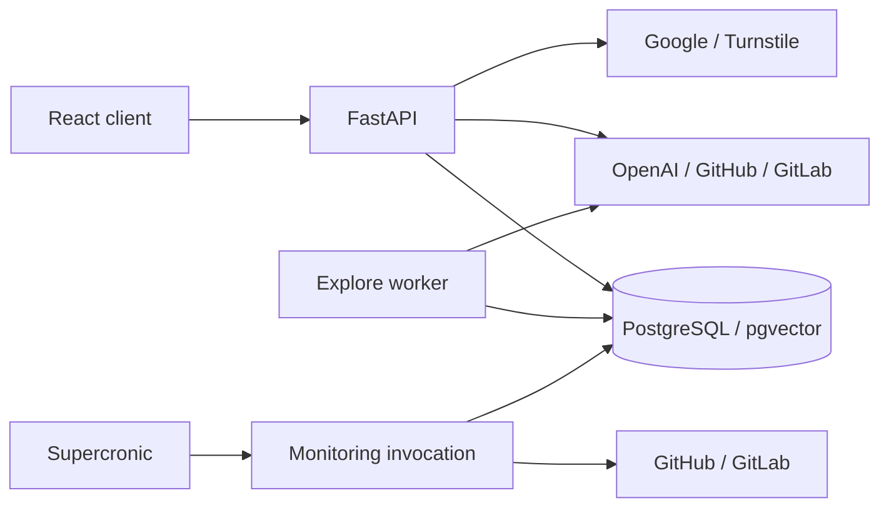

# SciScope Architecture

## Processes

The React/TypeScript frontend calls a Python backend backed by PostgreSQL/pgvector.
Each backend container runs three processes through
[Supervisor](../backend/infra/supervisord.conf). They share database state, not Python state.

| Process | Entrypoint | Lifecycle |
| --- | --- | --- |
| API | `app.api.app:app` | Uvicorn; startup and `/ready` check DB connectivity |
| Explore worker | `app.jobs.process_search_runs` | Continuous polling; default idle interval 1 second |
| Monitoring scheduler | `supercronic` | Runs `app.jobs.scan_subscriptions` every even UTC hour at minute 0 |

Supervisor restarts unexpected exits and forwards logs to stdout/stderr. Its
configuration has no control socket; recovery cannot use `supervisorctl restart`.
A Machine/container restart interrupts all three processes and any active scan.

[Fly](../fly.toml) builds the backend Dockerfile and applies Alembic migrations
before the new application starts. The [release workflow](../.github/workflows/release.yml)
creates semantic releases; it does not deploy to Fly. `/ready` tests connectivity,
not schema compatibility, worker progress, Feed freshness or provider availability.

## Durable Ownership

| State | Owner and commit boundary | Recovery |
| --- | --- | --- |
| Explore admission and scheduling | `storage/search_admission.py`: usage event, run and operation commit together | Rejected admission or a write failure schedules no work |
| Explore execution | Worker claims an operation; `storage/search_runs.py` publishes response, execution JSON, reports and statuses together | Unfinished work replays from the last committed baseline |
| Repository catalog | Catalog ingestion and validated profile lookup through repository storage | Optional ingestion can fail independently of delivered search results |
| Subscriptions | User-owned watch, unique by user and repository | Repeated creation returns the winning watch |
| Monitoring results | Feed upserts and completed-stream cursors commit per repository | Incomplete streams retain their boundary; retries preserve event IDs/read state |
| Monitoring summaries/checks | Separate transactions from repository results | A crash can leave a `running` summary after some repositories committed |
| Sessions | Durable token hash with expiry/revocation | Process restart does not revoke sessions |

Explore creates no subscriptions, but writes usage, runs, reports and catalog
facts. The browser creates/polls `search-runs` and requests `expand`; the direct
`/api/explore/search` endpoint executes in the API without a durable operation.
Guest runs require `X-Search-Run-Token`; signed-in runs require their owner.

Explore claims use `SKIP LOCKED`, a fresh fencing token and database wall time.
The default 300-second lease renews every third of its duration. Expired/superseded
attempts cannot publish results. External calls can repeat on replay. Terminal
failures are not automatically requeued. Persisted JSON validation and conversion
are defined in [Explore execution state](contracts/explore-execution-state.md).

Monitoring instead uses a 1,800-second job lease without renewal or result fencing.
It does not guarantee exclusivity after expiry. Commit bootstrap uses timestamps;
subsequent scans track newly reachable commits by SHA, including old-dated commits.
Rewritten/unreadable history stays partial. Details and limits are in
[Repository Monitoring](operations/repository-monitoring.md).

## Code Boundaries

The package map and product pipeline are in the [backend README](../backend/README.md).
Typical calls flow `api -> services -> integrations/storage`; storage uses database
internals. Composition selects implementations, while services invoke capabilities.
Integrations own provider protocol/mapping, services own admission/ranking policy,
and storage owns transactions and error translation.

API and worker processes each construct their own `ExploreDependencies` and
provider clients; scan/repair invocations construct their own sets. Each GitHub
installation auth instance owns its token cache and refresh lock. Configuration
changes take effect on reconstruction/restart. Quotas, ownership and progress
are durable database state. PostgreSQL application engines use READ COMMITTED.

| Detailed contract | Use it for |
| --- | --- |
| [Authentication](contracts/authentication-boundaries.md) | Sessions, OAuth validation and request identity |
| [Runtime dependencies](contracts/runtime-dependencies.md) | Client/cache lifetimes and injection |
| [Persistence errors](contracts/persistence-errors.md) | Rollback, failure categories and retry decisions |
| [PostgreSQL correctness](contracts/postgresql-correctness.md) | Database-specific guarantees and test setup |
| [Backend quality gates](contracts/backend-quality-gates.md) | Executable import/cycle, lint and type checks |

[Backend recovery](operations/backend-recovery.md) contains operational commands.
[AGENTS.md](../AGENTS.md) defines engineering policy.
